# Developer Portfolio

This is my developer portfolio, built with Next.js + shadcn UI.

## 📑 Table of Contents

- [Overview](#overview)
  - [Screenshots](#screenshots)
  - [Features](#features)
  - [Run Locally](#run-locally)
- [My process](#my-process)
  - [Built with](#built-with)
  - [Continued development](#continued-development)
  - [Useful resources](#useful-resources)

## Overview

This is a beautiful developer portfolio built with Next.js. It has a home page, about page, projects page, and a blog page. It also has a contact form, various sections, and a theme toggle.

This portfolio is designed with scalability and real-world UX in mind, using shadcn for reusable components and Tailwind for styling.

### Screenshots

<p align='center'>
  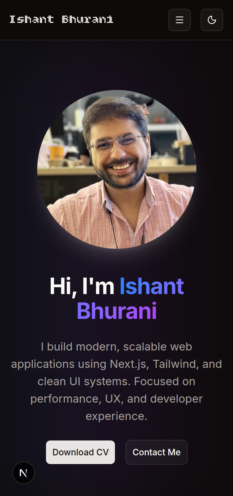
  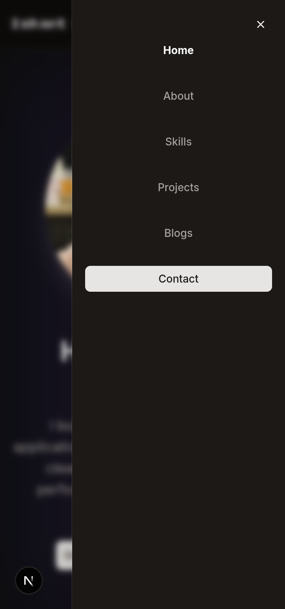
</p>

<p align="center">
  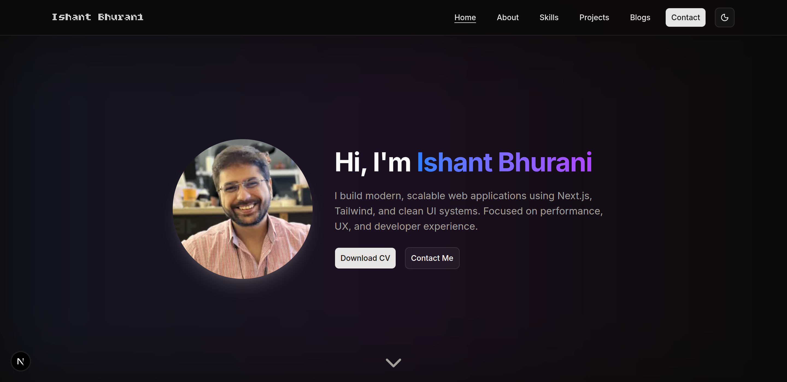
  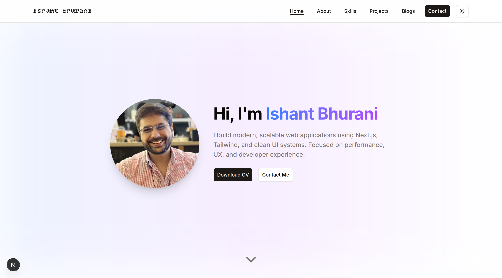
  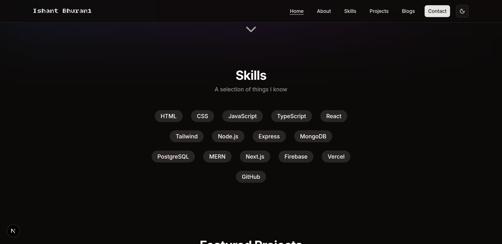
</p>

<p align="center">
  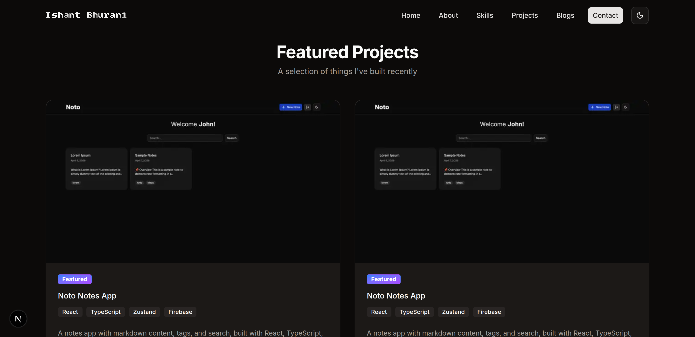
  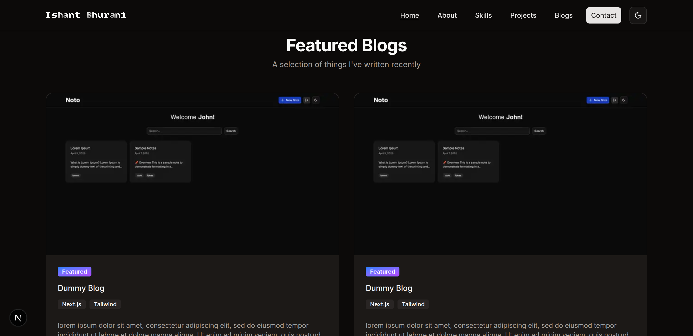
  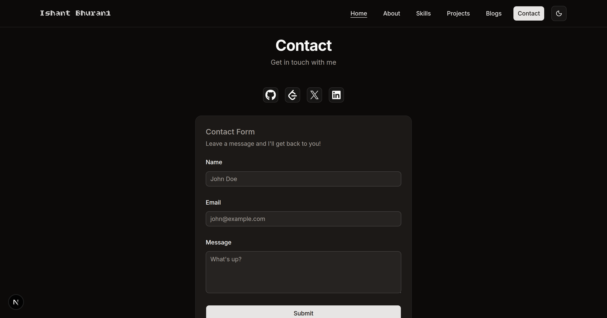
</p>

<p align="center">
  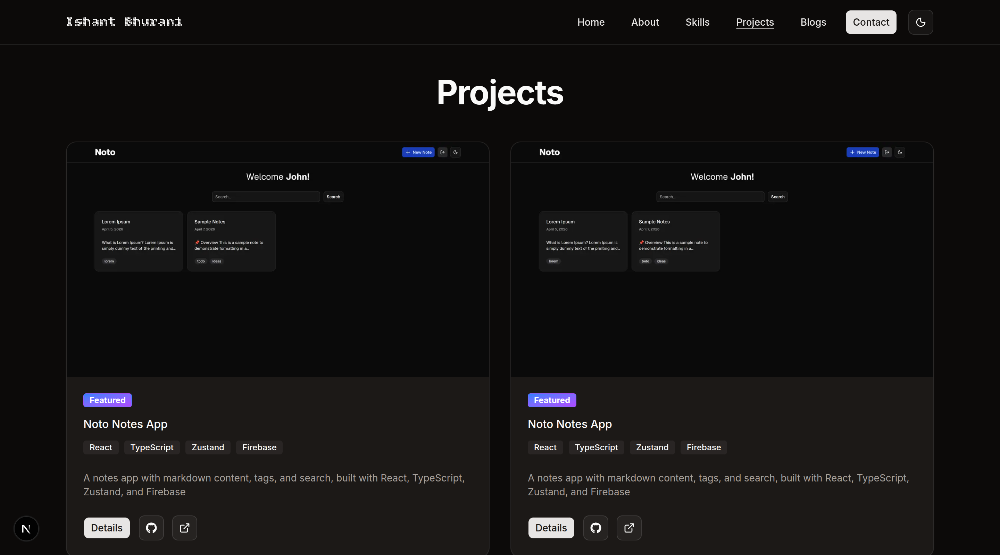
  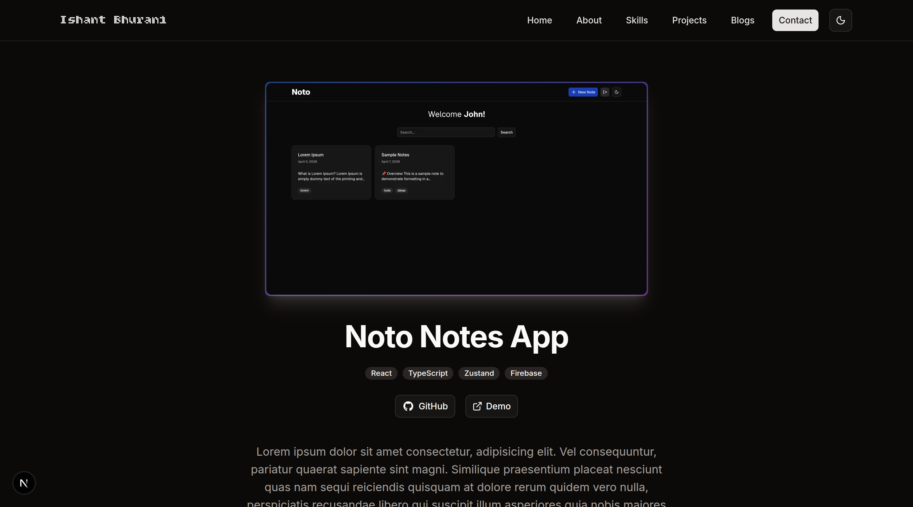
  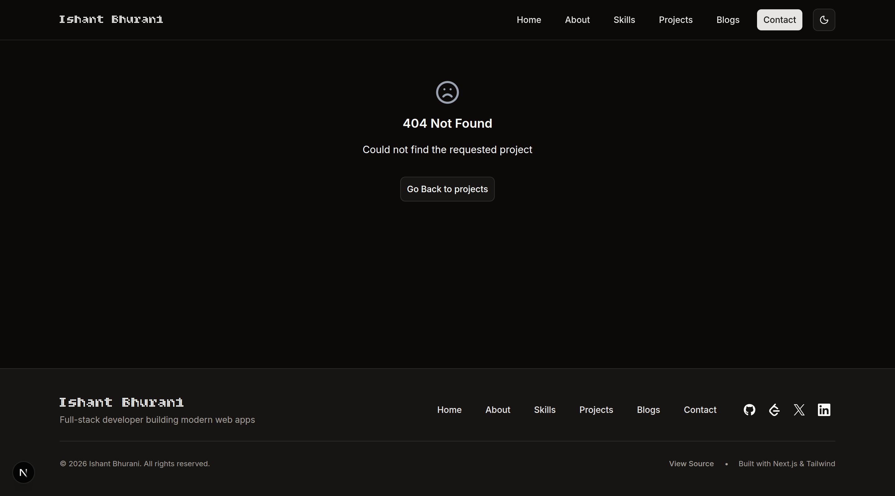
</p>

<p align="center">
  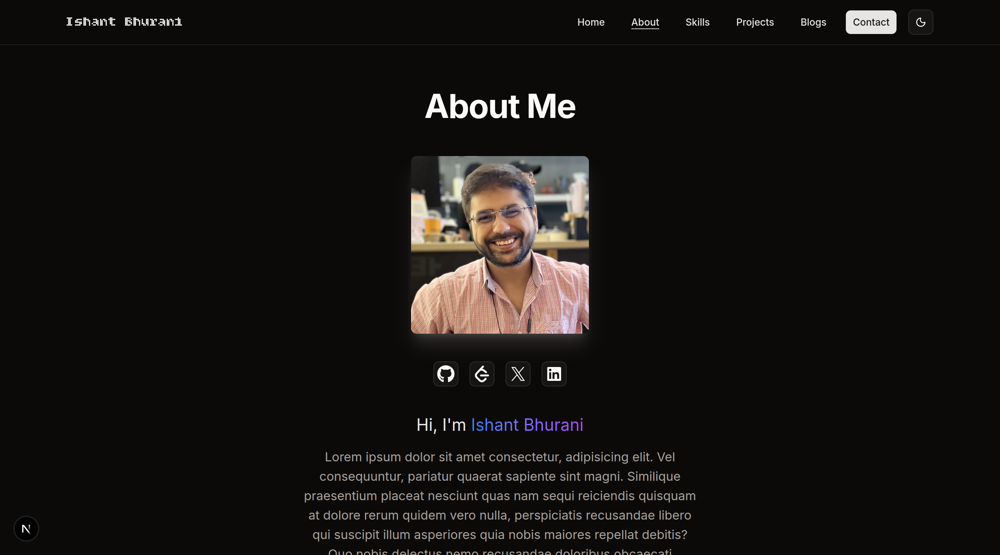
  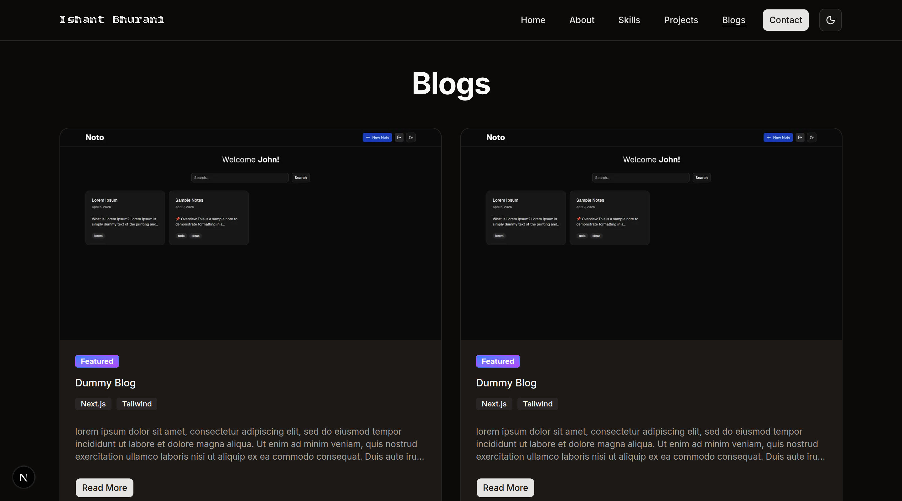
</p>

### Features

- View various section on the home page - hero, skills, featured projects, featured blogs, and contact
- Send a message through the contact form, or contact using various social profiles
- Explore various projects and blogs in a comfortable grid layout
- Navigate to project demos and GitHub repos effortlessly
- Get visual feedbacks with error states and toast notifications
- Responsive design for mobile and desktop
- Dedicated project details screen
- Light & Dark mode theme toggle
- Theme preference persisted using localstorage

### Run Locally

#### Clone the repository

```bash
git clone https://github.com/ishantbh/portfolio.git
cd portfolio
```

#### Install dependencies

```bash
pnpm install
```

#### Build the app

```bash
pnpm build
```

#### Run the app

```bash
pnpm preview
```

## My process

### Built with

- [Next.js](https://nextjs.org/) - Core framework
- [React](https://react.dev/) - UI library
- [Tailwind](https://tailwindcss.com/) - Styling
- [shadcn](https://ui.shadcn.com/) - UI components
- [sonner](https://sonner.emilkowal.ski/) - Toast notifications
- [Lucide](https://lucide.dev/) - Icons

### Continued development

- Contact form submission to Netlify Forms
- CRM integration for projects and blogs
- Filter by tags/categories for projects and blogs
- Pagination for projects and blogs
- Virtualization for projects and blogs
- Searching/filtering/sorting for projects and blogs

### Useful resources

- [Next.js file-system based routing](https://nextjs.org/docs/app/getting-started/layouts-and-pages)
- [Next.js server and client components](https://nextjs.org/docs/app/getting-started/server-and-client-components)
- [Next.js image optimization](https://nextjs.org/docs/app/getting-started/images)
